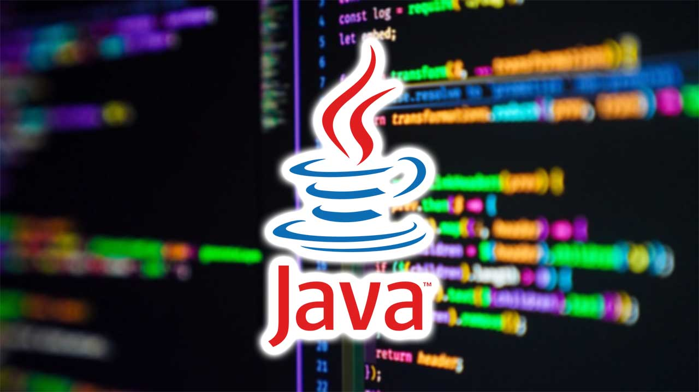

# Programación - 1º DAW (curso 24-25)

> Curso auxiliar para el alumnado del módulo de Programación :man_technologist:

## :books: Unidades de Programación
1.  [Introducción a la programación y al lenguaje Java](https://github.com/pbendom3/prog-1cfgs-daw/blob/main/ups/UP1/up1.md) (1ºT - 20h)
2.  [Programación básica: estructuras de control](https://github.com/pbendom3/prog-1cfgs-daw/blob/main/ups/UP2/up2.md) (1ºT - 24h)
3.  [Estructuras de datos](https://github.com/pbendom3/prog-1cfgs-daw/blob/main/ups/UP3/up3.md) (1ºT - 28h)
4.  [Programación modular](https://github.com/pbendom3/prog-1cfgs-daw/blob/main/ups/UP4/up4.md) (1ºT - 28h + 12h proyecto)
5.  [Introducción a la Programación Orientada a Objetos (POO)](https://github.com/pbendom3/prog-1cfgs-daw/blob/main/ups/UP5/up5.md) (2ºT - 24h)
6.  [Uso avanzado de clases y objetos](https://github.com/pbendom3/prog-1cfgs-daw/blob/main/ups/UP6/up6.md) (2ºT - 28h)
7.  [Colecciones dinámicas de datos y programación funcional](https://github.com/pbendom3/prog-1cfgs-daw/blob/main/ups/UP7/up7.md) (2ºT - 32h + 12h proyecto)
8.  [Programación gráfica y acceso a datos](https://github.com/pbendom3/prog-1cfgs-daw/blob/main/ups/UP8/up8.md) (3ºT - 48h) **- Periodo de Formación en Empresa**

---

> [!TIP]
> :bookmark_tabs: [EXÁMENES DE RECUPERACIÓN](https://github.com/pbendom3/prog-1cfgs-daw/blob/main/ups/RECUS/recus.md)

[prueba](https://pbendom3.github.io/prog-1cfgs-daw/prueba/index.html)
