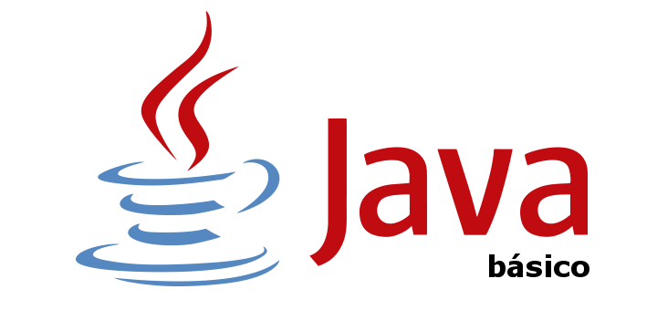

# UP1. Introducción a la programación y al lenguaje Java

## Estructura de la unidad
[INTRO. ¿Cómo funcionan los programas?]()
1.  [Estructura de un programa informático]()
2.  [Pseudocódigos y diagramas de flujo (DFD)]()
3.  [Lenguajes de programación]()
4.  [Fundamentos del lenguaje Java]() 

[EXÁMENES]()
