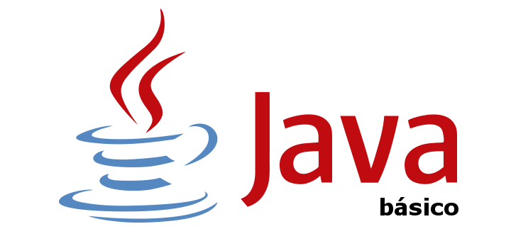

# UP1. Introducción a la programación y al lenguaje _Java_

## Estructura de la unidad
[INTRO. ¿Cómo funcionan los programas?]()
1.  [Estructura de un programa informático]()
2.  [Pseudocódigos y diagramas de flujo (DFD)]()
3.  [Lenguajes de programación]()
4.  [Fundamentos del lenguaje Java]() 

## EXÁMENES
- [Teórico](1_EXAMEN_TEÓRICO_UD1.pdf)
- [Práctico - modelo A](2_EXAMEN_PRÁCTICO_UD1_modelo_A.pdf)
- [Práctico - modelo B](3_EXAMEN_PRÁCTICO_UD1_modelo_B.pdf)
