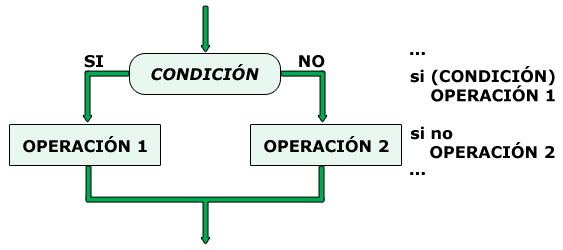

# UP2. Programación básica: estructuras de control

## Estructura de la unidad
1.  [Trabajando con cadenas de caracteres en Java (textos)](https://pbendom3.github.io/prog-1cfgs-daw/ups/UP2/2_1_cadenas/index.html)

      - [Práctica 1. Número de la suerte](Práctica1_Número_de_la_suerte.pdf)
     
3.  [Control de excepciones (nivel 2)](https://pbendom3.github.io/prog-1cfgs-daw/ups/UP2/2_2_excepciones/index.html)
4.  [Estructuras de control condicional]()
5.  [BONUS: el operador ternario en Java]()
6.  [Estructuras de control repetitivas/iterativas (bucles)]()
7.  [BONUS. Clase Random (generación de valores aleatorios)]()
8.  [Trazas]()
   
## EXÁMENES
- [Teórico - modelo A](1_EXAMEN_TEÓRICO_UD2_DAM.pdf)
- [Teórico - modelo B](2_EXAMEN_TEÓRICO_UD2_DAW.pdf)
- [Práctico - modelo A](3_EXAMEN_PRÁCTICO_UD2_A.pdf)
- [Práctico - modelo B](4_EXAMEN_PRÁCTICO_UD2_B.pdf)
