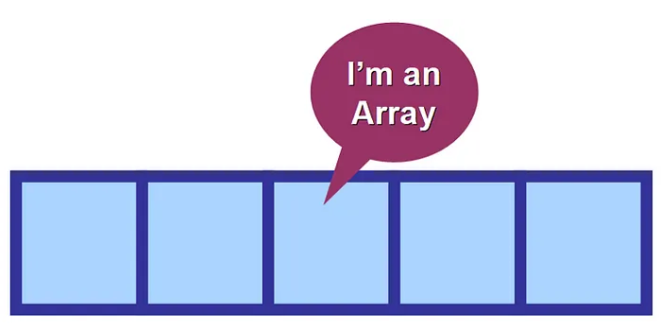

# UP3. Estructuras de datos

## Estructura de la unidad
1.  [Estructura de los vectores (arrays)](https://pbendom3.github.io/prog-1cfgs-daw/ups/UP3/3_1_arrays/index.html)

     - [Práctica 1. Batalla de samuráis](2_Práctica1_Batalla_de_samuráis.pdf)
    
    :pushpin: [Ampliación split() y uso de asList()](https://pbendom3.github.io/prog-1cfgs-daw/ups/UP3/3_2_split_aslist/index.html)
       
2.  [Ordenación de arrays](https://pbendom3.github.io/prog-1cfgs-daw/ups/UP3/3_3_ordenacion/index.html)

     :pushpin: [Eliminar duplicados de un array con el método .distinct()](https://pbendom3.github.io/prog-1cfgs-daw/ups/UP3/3_4_duplicados/index.html)

     - [Práctica 2. Simulación del sorteo de la Primitiva](6_Práctica2_Simulación_del_sorteo_de_la_Primitiva.pdf)

:gift: [BONUS [pre-matrices]. Etiquetar (bautizar) bucles anidados](https://pbendom3.github.io/prog-1cfgs-daw/ups/UP3/3_5_etiquetas/index.html)

4.  [Matrices (arrays bidimensionales)](https://pbendom3.github.io/prog-1cfgs-daw/ups/UP3/3_6_matrices/index.html)
5.  [Tratamiento de vectores en matrices](https://pbendom3.github.io/prog-1cfgs-daw/ups/UP3/3_7_vectores_matrices/index.html)

     - [Práctica 3. Sopa de letras automatizada](10_Práctica_3_Sopa_de_letras.pdf)
   
## EXÁMENES
- [Teórico](11_EXAMEN_TEÓRICO_UD3.pdf)
- [Práctico](12_EXAMEN_PRÁCTICO_UD3.pdf)
