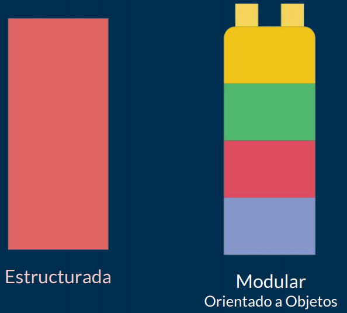

# UP4. Programación modular

## Estructura de la unidad
1.  [Estructura de un programa Java: funciones y procedimientos]()
2.  [Ámbitos de una variable y sobrecarga de métodos]()
3.  [Recursividad]()
4.  [BONUS. Buenas prácticas: Javadoc]()
5.  [Introducción a las pruebas unitarias con JUnit]()

### Proyecto individual

**Fase 1**. Elección de proyecto.
> Entra en el sitio web de *ProgramaMe: Concurso de Programación para Ciclos Formativos* y elige alguno de los ejercicios que aparecen en los cuadernillos del histórico de problemas: https://programame.com/archive.php

**Fase 2**. Desarrollo, documentación y entrega del proyecto.

**Fase 3**. Exposición + taller de evaluación entre iguales.

## EXAMEN [Teórico](8_EXAMEN_TEÓRICO_UD4.pdf)
