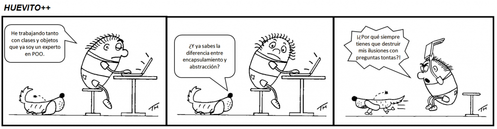

# UP5. Introducción a la _Programación Orientada a Objetos (POO)_

## Estructura de la unidad
1.  [Introducción a la POO](https://pbendom3.github.io/prog-1cfgs-daw/ups/UP5/5_1_introduccion_POO/index.html)
2.  [Método toString() y uso de elementos static](https://pbendom3.github.io/prog-1cfgs-daw/ups/UP5/5_2_tostrinc_static/index.html)
3.  [Relaciones simples entre clases](https://pbendom3.github.io/prog-1cfgs-daw/ups/UP5/5_3_relaciones/index.html)

    🎁 [BONUS. ArrayList de objetos]()
   
[Práctica 1. "El Formiguero" y "La Rebelión"]()

[Práctica 2. [PlantUML] Funcionalidades útiles para la POO (diagramas de clases automáticos)]()

[Práctica 3. Librerías de ayuda para la implementación de la POO: LOMBOK]()

[Ampliación [pre-examen]. App Bancaria]()

## EXÁMENES
- [Teórico](9_EXAMEN_TEÓRICO_UD5.pdf)
- [Práctico - modelo A](10_EXAMEN_PRÁCTICO_UD5.pdf)
- [Práctico - modelo B](11_EXAMEN_PRÁCTICO_UD5.pdf)
