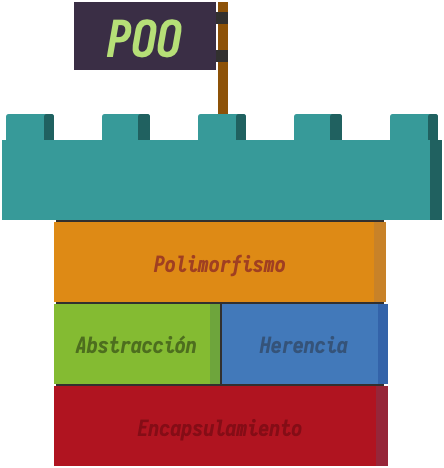

# UP6. Uso avanzado de clases y objetos

## Estructura de la unidad
1.  [Herencia y polimorfismo](https://pbendom3.github.io/prog-1cfgs-daw/ups/UP6/6_1_herencia/index.html)
2.  [Clases abstractas (_abstract_)](https://pbendom3.github.io/prog-1cfgs-daw/ups/UP6/6_2_abstractas/index.html)

      - [Práctica 1. Sistema de pago E-commerce](3_Práctica_1_Sistema_pago_ecommerce.pdf)
     
3.  [Interfaces y clases anónimas](https://pbendom3.github.io/prog-1cfgs-daw/ups/UP6/6_3_interfaces_clases_anonimas/index.html)

🎁 [BONUS. Tipos enumerados (_enum_)](https://pbendom3.github.io/prog-1cfgs-daw/ups/UP6/6_4_enums/index.html)

4.  [Excepciones personalizadas]()
   
      - [Práctica 2. Copa del Rey: Mutxamel FC vs Real Madrid]()

## EXÁMENES
- [Teórico](8_EXAMEN_TEÓRICO_UD6.pdf)
- [Práctico - modelo A](9_EXAMEN_PRÁCTICO_UD6.pdf)
- [Práctico - modelo B](10_EXAMEN_PRÁCTICO_UD6.pdf)
