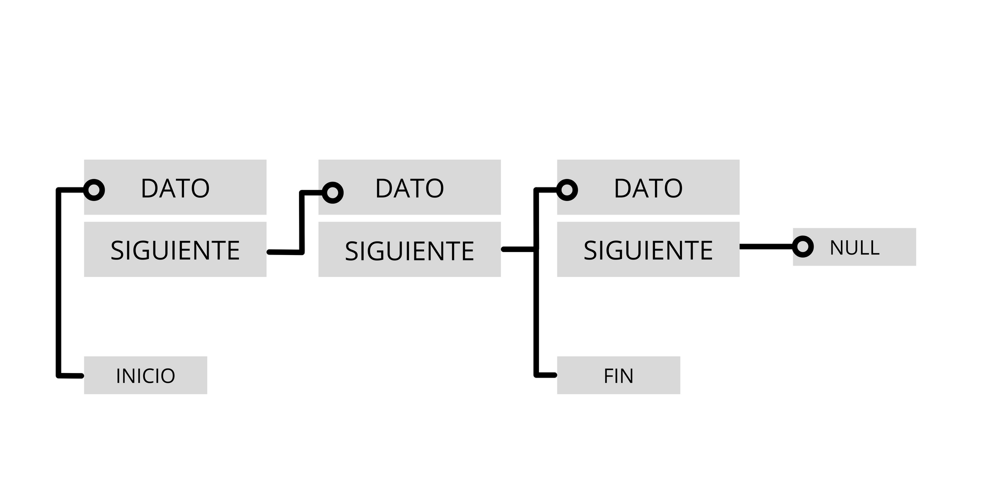

# UP7. Colecciones dinámicas de datos y programación funcional

## Estructura de la unidad
1.  [Colecciones - listas (List), colas (Queue) y conjuntos (Set)](https://pbendom3.github.io/prog-1cfgs-daw/ups/UP7/7_1_colecciones/index.html)
2.  [Mapas o diccionarios (interfaz _Map_ --> (_clave-valor_))]()
3.  [Métodos útiles para la manipulación de colecciones]()
4.  [BONUS. Tipos enumerados (_enum_)]()
5.  [Excepciones personalizadas]()

[Práctica. Servicio de compra online en MERCADAW]()

[BONUS. Manipulación de cadenas de texto con StringBuilder]()

### EXÁMENES
- [Teórico](6_EXAMEN_TEÓRICO_UD7.pdf)
- [Práctico](7_EXAMEN_PRÁCTICO_UD7.pdf)

6. [Programación funcional. Funciones lambda y operaciones intermedias streams]()

### Proyecto por equipos

  **Fase 1**. Elección de proyecto.
  
  **Fase 2**. Desarrollo, documentación y entrega del proyecto.
  
  **Fase 3**. Exposición + taller de evaluación entre iguales.
